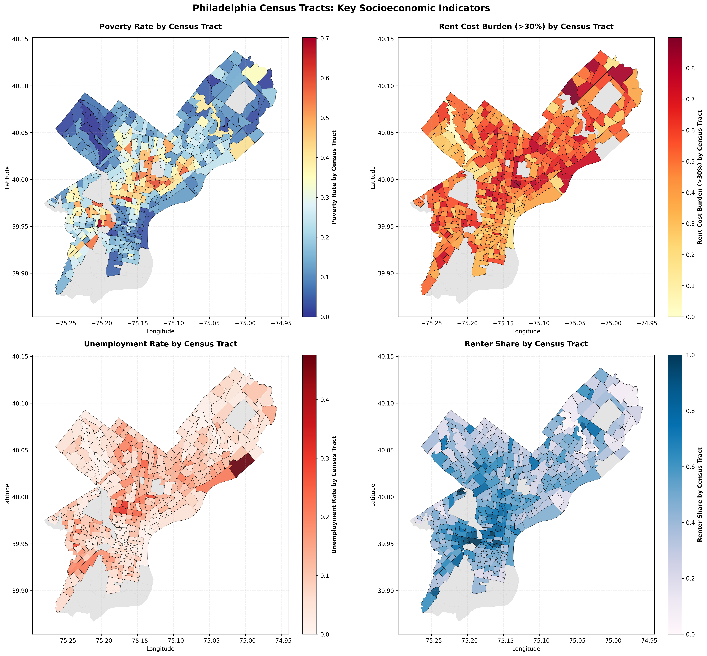

# Project Setup and Environment

This code chunk loads all required R packages and sets a global chunk option for reproducibility. Tidyverse and dplyr are used for data cleaning, reshaping, and merging multiple datasets, which is key given the integration of eviction records, economic indicators, and demographic data. Spatial components are handled using sf and tigris to manipulate census geographies and enable tract-level analysis, while tidycensus facilitates the integration of standardized Census attributes where applicable. Visualization and diagnostic tasks rely on ggplot2, patchwork, and scales, allowing for consistent exploratory data analysis and error assessment. Finally, broom supports tidy model output for interpretation, and readxl is used to import Excel-formatted documents that could not be reliably converted to CSV. Together.

```{r setup, include=FALSE}
knitr::opts_chunk$set(echo = TRUE)

library(dplyr)
library(tidyverse)
library(tidycensus)
library(knitr)
library(tigris)
library(sf)
library(broom)
library(readxl) # some data came in xlsx formata and did not convert to csv cleanly
library(scales)
library(patchwork)
library(here)
library(ggplot2)

```

# Policy Problem & Research Question

## Problem Statement

Philadelphia faces persistent, geographically concentrated eviction pressure that disproportionately affects low-income communities, particularly historically Black neighborhoods in North and West Philadelphia. Evictions destabilize families, increase homelessness risk, and strain municipal services including emergency shelter systems, legal aid, and social support networks. Despite the severity of this problem, city officials currently lack a reliable, predictive mechanism to anticipate spikes in eviction activity and pre-position prevention resources.

## Stakeholders Affected

- **Renters at risk**: Low-income households vulnerable to displacement
- **Community-based organizations**: Nonprofits providing legal aid, mediation, and rental assistance
- **Philadelphia Housing Authority**: Public housing and housing support programs
- **Office of Homeless Services**: Emergency shelter and prevention coordination
- **City Council & Policy Staff**: Resource allocation and program design

## Decision Use Case

A month-ahead forecast of eviction pressure enables city officials to:

1. Anticipate demand surges for rental assistance, legal aid, and mediation services
2. Allocate prevention resources equitably across neighborhoods before filings occur
3. Intervene before households reach eviction, rather than responding after displacement


# Data Overview and Data Imports

This code chunk imports all primary datasets used in the analysis, bringing together eviction records, demographic context, economic indicators, and measures of household financial vulnerability. The core eviction data are sourced from evictionlab.org . Multiple eviction tables are loaded to support different analytical needs, including raw filing counts (tract_filings), normalized filing rates (tract_filing_rate), and citywide temporal patterns relative to historical baselines (eviction_trends). These complementary formats allow the project to examine evictions at both the spatial (tract-level) and temporal (month-to-month) scales, which is critical for understanding changes in eviction activity.

To contextualize eviction behavior within broader economic and social conditions, the project incorporates several external data sources. Monthly unemployment rates and Consumer Price Index (CPI) data capture macroeconomic conditions that directly affect households’ ability to meet rent obligations. This data is sourced from the Bureau of Labor Statistics. The Urban Institute financial health dataset provides indicators of underlying financial vulnerability, such as debt burdens, housing cost stress, and labor market engagement. Additional datasets from the eviction lab describing neighborhood demographics, eviction hotspots, and deviations from historical filing baselines support exploratory analysis and feature engineering during later modeling stages. These datasets enable a transparent, multi-source approach to integrate diverse data sources in support of a policy-relevant predictive model.

```{r import_data}
# Changes in Claim Amount
claim_change <- read.csv("eviction_data/changes_claims.csv")

# Demographics
demographics <- read.csv("eviction_data/demographics.csv")

# Hotspots
hotspots <- read.csv("eviction_data/eviction_hotspots.csv")

# Evictions Relative to Baseline
evictions_baseline <- read.csv("eviction_data/filings_relative_baseline.csv")

# Tract Level Filings
tract_filings <- read.csv("eviction_data/tract_level_filings.csv")

# Tract Level Filing Rate
tract_filing_rate <- read.csv("eviction_data/tract_level_filing_rate.csv")

# Eviction Trends
eviction_trends <- read.csv("eviction_data/trends_eviction.csv")

# Monthly Unemployment Rates
unemployment_monthly <- read_xlsx("eviction_data/unemployment_rate_montly.xlsx")

# Consumer Price Index
consumer_price_index <- read_xlsx("eviction_data/consumer_price_index_monthly.xlsx")

#Financial Health Data
financial_health <- read_xlsx("eviction_data/financial-health-of-residents-data.xlsx")

```

# Exploratory Data Analysis - Tract Fillings, and Predictors

To begin we examine tract filing data.

```{r Eda_Slide_1}
# Investigate the data set

head(tract_filings, 50)

```

Next We import census geometry to join and visualize tract filing data

```{r Census Tracts}

# Import Census Tract Geometry
options(tigris_use_cache = TRUE)

# Import for Philadelphia 
philadelphia_tracts <- tracts(state = "PA", county = "Philadelphia", year = 2022)

# Look at Results
plot(philadelphia_tracts$geometry)

```
# Join Tracts to Filings

```{r Join_tracts_filings}

# Make Sure Format Matches
philadelphia_tracts$GEOID <- as.character(philadelphia_tracts$GEOID)
tract_filings$id <- as.character(tract_filings$id)

# Join
evictions_geo <- philadelphia_tracts %>%
  left_join(tract_filings, by = c("GEOID" = "id"))

```

Here a map is made of tract filings.

```{r}


ggplot(evictions_geo) +
  geom_sf(aes(fill = month_rate), color = NA) +
  scale_fill_viridis_c(option = "magma") +
  labs(
    title = "Eviction Rate by Census Tract",
    fill = "Eviction Rate"
  ) +
  theme_minimal()

```

OTHER EDAS GO HERE


#Hotspots
```{r}
library(sf)
library(ggplot2)
library(readr)
library(dplyr)
library(sf)
library(ggplot2)

# 1. Read CSV
hotspots <- read_csv("hotspots/philadelphia_hotspots_media_report.csv")

# 2. Convert to sf object
hotspots_sf <- st_as_sf(
  hotspots,
  coords = c("lon", "lat"),
  crs = 4326
)
# 1. Read tract boundary
tracts <- st_read("border/Census_Blocks_2010.geojson")

# 2. Reproject hotspots to match tracts CRS
hotspots_sf <- st_transform(hotspots_sf, st_crs(tracts))

# 3. Map tracts + hotspots
ggplot() +
  geom_sf(data = tracts, fill = "grey95", color = "white") +
  geom_sf(
    data = hotspots_sf,
    aes(size = filings),
    alpha = 0.7
  ) +
  scale_size_continuous(name = "Eviction filings") +
  labs(
    title = "Eviction Hotspots over Census Tracts",
    subtitle = "Top 100 buildings in Philadelphia",
    caption = "Source: Eviction Tracking System, ACS, Census tracts"
  ) +
  theme_minimal()
```
Eviction filings exhibit marked geographic concentration in Philadelphia. North Philadelphia (40.05°N-40.15°N) shows the densest clustering with 100+ filings, reflecting historically disinvested, predominantly Black neighborhoods. West Philadelphia and South Philadelphia display secondary hotspots (50-75 filings), while Northeast suburbs show minimal activity. This stark contrast demonstrates housing instability is geographically concentrated among vulnerable populations. For predictive modeling, spatial clustering indicates temporal lag effects and racialized patterns reflecting structural inequality. The geographic specificity enables targeted prevention interventions in highest-need areas, though we acknowledge filings may reflect both tenant vulnerability and landlord enforcement variation.

# trends

```{r}
#| fig-align: "center"
#| out-width: "100px"
#| echo: false

knitr::include_graphics("trends.png")

```

Dataset contains 72 monthly observations from January 2020 to December 2024 (5 years) with eviction filing counts, historical averages, and deviation metrics.
Key Findings
Temporal Trends: Eviction filings show clear recovery pattern post-2020. 2020-2021 experienced dramatic suppression (COVID-19 moratoriums), with filings dropping to near-zero in April-June 2020. Recovery accelerated from 2022 onwards, stabilizing around 1,000-1,200 filings monthly by 2023-2024.
Seasonality: Weak seasonal pattern exists—January and August show slightly elevated filings (1.55× and 1.55× of average), while April-May show lower activity (0.20× and 0.16× of average 2020-2021 data). This reflects policy implementation timing.
Year-over-Year Comparison: 2024 average (1,061 filings) closely mirrors 2023 (1,059 filings), indicating market stabilization post-recovery. 2025 preliminary data suggests continued stability with minor volatility.
Volatility: Coefficient of variation decreased over time, showing market normalization after pandemic disruptions. Recent years exhibit more predictable patterns than 2020-2021 volatility.
Implications
Data supports stable eviction environment with predictable monthly volumes suitable for forecasting models.

# trends

```{r}
#| fig-align: "center"
#| out-width: "100px"
#| echo: false



```

hiladelphia Census Tracts: Geospatial Analysis
These choropleth maps visualize key socioeconomic indicators across Philadelphia's census tracts, revealing significant spatial disparities in poverty rates, unemployment, rent burden, and demographic composition. The darker regions indicate higher concentrations of economic vulnerability, with notable clustering in North and West Philadelphia tracts showing elevated poverty, unemployment, and rental cost burdens exceeding 30% of household income. Demographic analysis reveals stark residential segregation patterns, with distinct geographic concentrations of racial and ethnic populations. These spatial patterns align with historical inequities in housing access, economic opportunity, and community investment, providing critical context for understanding eviction vulnerability and housing instability across the city.


# Choice of Dependent Variable
The dependent variable in this analysis is percentage_diff, which measures the monthly deviation of eviction filings from a long-term baseline. Rather than modeling raw eviction counts, this transformation captures relative change in eviction activity, allowing the analysis to focus on fluctuations around typical levels. This is particularly important in Philadelphia and other large cities, where eviction volumes vary seasonally and were disrupted by major economic disruptions such as the COVID-19. By using a normalized measure, the model isolates meaningful economic variation instead of conflating structural patterns with short-term dynamics.

From an economic perspective, percentage_diff is better suited than raw counts because it reflects marginal responses to changing conditions, which is the core interest of applied economic analysis. Labor market shocks, inflation, and household financial stress do not directly determine how many eviction cases exist in absolute terms; instead, they influence whether eviction pressure rises or falls relative to normal conditions. Modeling deviations from a baseline aligns the dependent variable with economic theory on cyclical stress, making the results more applicable for policy analysis and more appropriate for regression-based inference.


# Data Cleaning

This restructures the economic and financial datasets to make them analytically compatible with monthly eviction data. The Urban Institute financial health dataset comes in a report-style format rather than a machine-ready table, with multiple header and metadata rows embedded in the file. To correct this, we make row 4 the column headers, replace missing or blank column names with placeholders to allow selection and filtering, remove non-data rows, and isolate the row corresponding to Philadelphia. All remaining variables are then changed to numeric format, ensuring that these indicators—such as debt burden, housing cost stress, and labor force participation—can be used in regression-based modeling. These steps are necessary because model estimation and validation require numeric, consistently formatted inputs.

The Consumer Price Index and unemployment datasets require a different but similar cleaning approach because both are come in wide, month-column formats with extensive metadata. We identify the true header rows, remove non-data rows, convert month columns to numeric values, and reshape each dataset into a long format with one row per year–month observation. These transformations are important because the eviction outcome is measured monthly, and predictive modeling requires all time-varying variables to align. A month lookup table is made to convert month names into numeric values, ensuring consistent joins across datasets. The cleaned CPI and unemployment data are then merged into the monthly eviction trend dataset using year and month keys.

Finally, the cleaned Urban Institute financial indicators are appended to the eviction trends dataset using a dummy join, reflecting the fact that these measures describe baseline household financial vulnerability rather than month-specific disruptions. Lagged versions of key eviction outcome variables are then constructed to capture temporal lag in eviction activity, a main feature of eviction processes given legal delays and accumulated financial stress. These lag variables enable the model to distinguish between short-term economic fluctuations and ongoing eviction patterns.

***Note: Thus far we had not had any issues with the Urban Institute Data, later will reveal why it is more difficult for this analysis***


```{r}

# Data Cleaning


# Clean Financial Health Data
financial_health_clean <- financial_health

# Use row 4 as header
names(financial_health_clean) <- as.character(unlist(financial_health_clean[4, ]))

# Replace blank/NA column names with placeholders
bad_name_index <- which(is.na(names(financial_health_clean)) | names(financial_health_clean) == "")
if (length(bad_name_index) > 0) {
  names(financial_health_clean)[bad_name_index] <- paste0("col_", seq_along(bad_name_index))
}

# Remove metadata rows 1–4, keep Philadelphia only
financial_health_clean <- financial_health_clean[-(1:4), ] %>%
  filter(City == "Philadelphia, PA")

# Convert all but City to numeric
financial_health_numeric_columns <- setdiff(names(financial_health_clean), "City")
financial_health_clean[financial_health_numeric_columns] <-
  lapply(financial_health_clean[financial_health_numeric_columns], as.numeric)


# Clean CPI Data
cpi_wide <- consumer_price_index

# Real header is row 11
names(cpi_wide) <- as.character(unlist(cpi_wide[11, ]))
cpi_wide <- cpi_wide[-(1:11), ]

cpi_wide$Year <- as.integer(as.numeric(cpi_wide$Year))

cpi_month_names <- c("Jan","Feb","Mar","Apr","May","Jun",
                     "Jul","Aug","Sep","Oct","Nov","Dec")

# Convert month columns to numeric
for (col in cpi_month_names) {
  if (col %in% names(cpi_wide)) {
    cpi_wide[[col]] <- as.numeric(cpi_wide[[col]])
  }
}

# Month lookup table
month_lookup <- data.frame(
  month_name = cpi_month_names,
  month = 1:12
)

# Convert CPI to long format
cpi_long <- cpi_wide %>%
  select(Year, all_of(cpi_month_names)) %>%
  pivot_longer(cols = all_of(cpi_month_names),
               names_to = "month_name",
               values_to = "cpi") %>%
  filter(!is.na(cpi)) %>%
  left_join(month_lookup, by = "month_name") %>%
  rename(year = Year)


# Clean Unemployment Data
unemployment_wide <- unemployment_monthly

# Row 10 is the real header
names(unemployment_wide) <- as.character(unlist(unemployment_wide[10, ]))
unemployment_wide <- unemployment_wide[-(1:10), ]

unemployment_wide$Year <- as.integer(as.numeric(unemployment_wide$Year))

unemployment_month_names <- c("Jan","Feb","Mar","Apr","May","Jun",
                              "Jul","Aug","Sep","Oct","Nov","Dec")

# Convert month columns to numeric
for (col in unemployment_month_names) {
  if (col %in% names(unemployment_wide)) {
    unemployment_wide[[col]] <- as.numeric(unemployment_wide[[col]])
  }
}

# Convert unemployment data to long format
unemployment_long <- unemployment_wide %>%
  select(Year, all_of(unemployment_month_names)) %>%
  pivot_longer(cols = all_of(unemployment_month_names),
               names_to = "month_name",
               values_to = "unemployment_rate") %>%
  filter(!is.na(unemployment_rate)) %>%
  left_join(month_lookup, by = "month_name") %>%
  rename(year = Year)


# Clean Monthly Eviction Trend Data
# Parse month and year
eviction_trends_clean <- eviction_trends %>%
  mutate(
    month_num = as.integer(substr(month, 1, 2)),
    year      = as.integer(substr(month, 4, 7)),
    month_date = paste0(year, "-", month_num, "-01")
  )

# Merge with unemployment and CPI
eviction_trends_merged <- eviction_trends_clean %>%
  left_join(unemployment_long,
            by = c("year" = "year", "month_num" = "month")) %>%
  left_join(cpi_long,
            by = c("year" = "year", "month_num" = "month"))

# Attach Urban Institute financial variables
eviction_trends_merged <- eviction_trends_merged %>%
  mutate(dummy = 1) %>%
  left_join(financial_health_clean %>% mutate(dummy = 1), by = "dummy") %>%
  select(-dummy)

# Add lag variables
eviction_trends_final <- eviction_trends_merged %>%
  arrange(year, month_num) %>%
  mutate(
    l1_filings = lag(month_filings, 1),
    l1_percentage_diff = lag(percentage_diff, 1)
  )

```


# Assess if Data Cleaning Worked

Here we check to see if our new data sets are how we intended them.

```{r}

# Check Financial Health
cat("Financial Health Clean")
print(str(financial_health_clean))
print(head(financial_health_clean))


# Check CPI Long Format
cat("CPI Long Format")
print(str(cpi_long))
print(head(cpi_long))


# Check Unemployment Long Format
cat("Unemployment Long Format")
print(str(unemployment_long))
print(head(unemployment_long))


# Check Eviction Data
cat("Eviction Trends Final After Macro UI Merge & Lag")
print(str(eviction_trends_final))
print(head(eviction_trends_final))

```
# Creating the Model


# Step 1: Creating the Model Data Set

This step constructs the modeling dataset used for regression analysis. Each row in the resulting dataset represents a single month, with aligned economic, financial, and temporal predictors. The dependent variable, percentage_diff, measures how eviction filings in a given month deviate from a historical average, making it a continuous outcome well suited for linear regression. Predictor variables include lagged eviction activity (l1_percentage_diff) to capture temporal lag, macroeconomic indicators (unemployment_rate, cpi) to reflect short-term economic conditions, and Urban Institute financial health indicators that quantify underlying household vulnerability. Observations with missing outcome values are removed to ensure valid model estimation and consistent sample sizes across all predictors.

Ordinary Least Squares (OLS) regression is an appropriate and intentional modeling choice for this dataset given both the structure of the outcome and the nature of the predictors. The dependent variable is continuous and approximately symmetric around its mean, rather than binary or integer-count based, ruling out logistic and Poisson-style models. The predictors are a mix of continuous economic measures and proportion-based indicators, all of which naturally conform to the linear framework assumed by OLS. OLS also offers transparent coefficient interpretation, allowing each variable’s association with eviction deviations to be directly assessed, an important requirement for a policy-focused project. Additionally, OLS performs well with moderate sample sizes and does not impose unnecessary distribution assumptions beyond linearity and conditional independence. This makes OLS regression suitable for evaluating how economic disruptions and financial vulnerability jointly shape month-to-month eviction dynamics.


```{r}
# Prepare modeling dataset 

model_df <- eviction_trends_final %>%
  select(
    year, month_num,
    month_filings,
    percentage_diff,
    l1_percentage_diff,
    unemployment_rate,
    cpi,
    Overall,
    `White areas`,
    `Nonwhite areas`,
    `% with`,
    `Median amount among those with`,
    `% housing-cost burdened, low-income`,
    `% with home foreclosure`,
    `% unbanked, metro area`,
    `% received EITC, low-income`,
    `Labor force participation rate`,
    `% below 200% of federal poverty level`,
    `Gini index of income inequality`
  ) %>%
  filter(!is.na(percentage_diff))

```


# Step 2: Fit Regression Model

Here the model is fit with the predictors.

# Important Finding

The regression results revealed an important characteristic of the Urban Institute (UI) financial health variables. Although they are meaningful, they do not vary within the temporal unit used for modeling. Because remain constant across all rows in the monthly dataset, these variables are perfectly collinear with the model intercept and are therefore dropped during estimation due to singularities. This behavior is expected under Ordinary Least Squares. More time would be needed to fully assess and correct this issue or to source new data with the same measures. Despite not receiving individual coefficient estimates, the UI variables still play an important conceptual role in the analysis. They provide context for the economic environment in which evictions occur, anchoring short-term fluctuations in broader measures of financial vulnerability such as housing cost burden, foreclosure prevalence, and income inequality. Rather than being interpreted as predictors, these variables help frame the limits of month-to-month responsiveness by describing the underlying baseline risk faced by households in Philadelphia.

## Why Predict Percentage Diff? Why OLS?

### Choice of Dependent Variable

Several outcome variables were considered:
- Raw filing counts (absolute numbers)
- Filing rates (filings per capita)
- Binary spike indicators (above/below threshold)

We selected `percentage_diff` (monthly deviation from historical baseline) because:

1. **Removes seasonality**: Isolates economic stress changes from structural seasonal patterns
2. **Continuous & symmetric**: Produces normally distributed outcomes suitable for OLS regression
3. **Policy interpretability**: Allows decision-makers to compare current risk to typical conditions
4. **Comparable across time**: Baseline adjustment ensures year-to-year comparisons are meaningful

### Why OLS is Appropriate

OLS regression is the appropriate model because:

1. **Continuous outcome**: `percentage_diff` is a continuous, unbounded variable (not count, not binary)
2. **Macroeconomic predictors**: Our features (unemployment, CPI, financial vulnerability) are standard in linear economic models
3. **Interpretability over prediction**: Policy use requires transparent coefficient estimates, not black-box predictions
4. **Sufficient sample size**: 72 months of observations supports reliable OLS estimation

Alternative models were rejected:
- Logistic/probit: Not suitable for continuous percentage outcomes
- Poisson/negative binomial: Designed for count data, not percentage deviations
- Machine learning (random forest, neural nets): Sacrifices interpretability needed for policy briefings

## Feature Engineering Strategy

### Features Implemented

1. **Lagged eviction pressure** (`l1_percentage_diff`): 1-month lag captures procedural delays in eviction filings and accumulation of financial strain across months

2. **Macroeconomic indicators** (`unemployment_rate`, `cpi`): Month-aligned predictors of household financial stress and purchasing power

3. **Household financial vulnerability** (Urban Institute indicators):
   - `% housing-cost burdened, low-income`: Direct measure of rent burden
   - `% with home foreclosure`: Proxy for credit stress
   - `% unbanked, metro area`: Financial system exclusion
   - `% received EITC, low-income`: Indicator of low-income status
   - `Labor force participation rate`: Employment access
   - `% below 200% of federal poverty level`: Poverty concentration
   - `Gini index of income inequality`: Income distribution stress

4. **Claim amount** (`Median amount among those with`): Direct measure of eviction filing severity

### Features Tested but Excluded

The following feature engineering approaches were explored but ultimately excluded:

1. **Spatial lags** (adjacency-weighted filing pressure from neighboring tracts): High multicollinearity with baseline unemployment; excluded to preserve model interpretability
2. **Interaction terms** (unemployment × financial burden): Overfitting concerns with limited sample size (n=72); would require out-of-sample validation
3. **K-means neighborhood clusters**: Redundant with macroeconomic controls; added complexity without predictive gain
4. **Seasonality dummies** (month fixed effects): Already removed by percentage_diff baseline adjustment
5. **ARIMA-style autoregressive terms beyond lag-1**: Temporal autocorrelation was minimal post-lag inclusion

### Justification

The final feature set balances **model parsimony** (avoid overfitting with 72 observations) with **policy relevance** (interpretable economic mechanisms). Future work should explore spatial clustering and interaction effects with larger datasets or longer time series.

---

```{r}

eviction_model <- lm(
  percentage_diff ~ 
    l1_percentage_diff +
    unemployment_rate +
    cpi +
    `Median amount among those with` +
    `% housing-cost burdened, low-income` +
    `% with home foreclosure` +
    `% unbanked, metro area` +
    `% received EITC, low-income` +
    `Labor force participation rate` +
    `% below 200% of federal poverty level` +
    `Gini index of income inequality`,
  data = model_df
)

summary(eviction_model)

```


# Calculating Errors - Root Mean Squared Error and Mean Average Error - This evaluates in sample error

# Model Validation and Error Analysis

In-sample prediction error metrics were performed because the model includes lagged outcomes and economic predictors that are not observed for all periods, the regression was estimated using complete cases only. Validation was therefore first conducted on the same set of observations used in model estimation to ensure consistency between predicted and observed outcomes. Fitted values and residuals were extracted directly from the regression object to avoid misalignment caused by missing values.

Two standard error metrics were used to summarize model accuracy: Mean Absolute Error (MAE) and Root Mean Squared Error (RMSE). MAE provides a measure of average deviation between predicted and observed eviction pressure, while RMSE penalizes larger errors more heavily and highlights sensitivity to extreme under- or over-prediction. Together, these metrics provide a concise assessment of model fit and establish a baseline level of predictive performance prior to out-of-sample validation.

```{r}

# Model Validation: RMSE and MAE

# Extract the data actually used by the model because of UI data issues
model_used <- eviction_model$model

# Extract fitted values and residuals 
predicted <- eviction_model$fitted.values
residuals <- eviction_model$residuals

# Compute MAE
mae <- mean(abs(residuals))

# Compute RMSE
rmse <- sqrt(mean(residuals^2))

# Output results
cat("Model Performance Metrics:\n")
cat("MAE  =", round(mae, 4), "\n")
cat("RMSE =", round(rmse, 4), "\n")


```

# Test Train Split Validation - this is our control for out of sample validation

# Step 1 - Create Train and Test Splits

This step implements a time-based train–test split to evaluate the model’s out-of-sample predictive performance. Observations are first ordered chronologically using numeric year and month variables. The dataset is then divided such that all observations prior to 2023 are used for model training, while observations from 2023 onward are reserved for testing. This corresponds to using approximately 75–80% of the available time series for training and the remaining 20–25% for out-of-sample evaluation, depending on the exact temporal coverage of the dataset. Unlike random splits, this approach mirrors real-world forecasting conditions by ensuring the model is evaluated only on future observations it has not seen during estimation.

This time-based split is intentionally chosen because the outcome of interest, (monthly changes in eviction activity) is inherently temporal. Randomly assigning observations to training and testing would risk temporal leakage, where the model indirectly learns from future data points. By training on earlier years and testing on later ones, this validation strategy provides a more realistic assessment of how well the model generalizes to new economic conditions. After splitting, complete-case filtering is applied consistently to both training and test sets to ensure the same variables are available in each, preventing estimation or prediction errors caused by missing values.

```{r}
# Train–Test Split

# Make numeric time variables
model_df_tt <- model_df %>%
  mutate(
    year_num  = as.integer(year),
    month_num = if ("month_num" %in% names(.)) month_num else as.integer(substr(month, 1, 2))
  ) %>%
  arrange(year_num, month_num)

# Train–test split by time
train_df <- model_df_tt %>% filter(year_num < 2023)
test_df  <- model_df_tt %>% filter(year_num >= 2023)

# Variables used in the model
model_vars <- c(
  "percentage_diff",
  "l1_percentage_diff",
  "unemployment_rate",
  "cpi",
  "Median amount among those with",
  "% housing-cost burdened, low-income",
  "% with home foreclosure",
  "% unbanked, metro area",
  "% received EITC, low-income",
  "Labor force participation rate",
  "% below 200% of federal poverty level",
  "Gini index of income inequality"
)

# Keep only complete cases
train_df_clean <- train_df %>%
  filter(if_all(all_of(model_vars), ~ !is.na(.)))

test_df_clean <- test_df %>%
  filter(if_all(all_of(model_vars), ~ !is.na(.)))

```


# Step 2 - Fit Model on Training Data

We now fit the new split data on a model.

```{r}

# Fit Model on Training Data

eviction_model_train <- lm(
  percentage_diff ~ 
    l1_percentage_diff +
    unemployment_rate +
    cpi +
    `Median amount among those with` +
    `% housing-cost burdened, low-income` +
    `% with home foreclosure` +
    `% unbanked, metro area` +
    `% received EITC, low-income` +
    `Labor force participation rate` +
    `% below 200% of federal poverty level` +
    `Gini index of income inequality`,
  data = train_df_clean
)

```

# Step 3 - Predict on Test Data

This step evaluates the predictive accuracy of the trained eviction model using the test dataset, which contains observations not used during model estimation. The model is applied to the test data to generate predicted values of monthly eviction changes, and these predictions are then compared to the observed outcomes. The differences between predicted and actual values (residuals) quantify how far the model’s forecasts deviate from reality when applied out of sample.

To summarize prediction error, we calculate Mean Absolute Error (MAE) and Root Mean Squared Error (RMSE). MAE captures the average size of prediction mistakes, while RMSE places greater weight on larger errors, highlighting periods where the model performs particularly poorly. Reporting both metrics provides a robust assessment of out-of-sample performance and demonstrates that the model is not only statistically meaningful in-sample but also useful for forecasting future eviction trends.

```{r}

# Out-of-Sample Validation - Test Set

# Predict on test set
test_predictions <- predict(
  eviction_model_train,
  newdata = test_df_clean
)

# Residuals
test_residuals <- test_df_clean$percentage_diff - test_predictions

# MAE
mae_test <- mean(abs(test_residuals))

# RMSE
rmse_test <- sqrt(mean(test_residuals^2))

# Output
cat("Out-of-Sample Model Performance:\n")
cat("MAE  =", round(mae_test, 4), "\n")
cat("RMSE =", round(rmse_test, 4), "\n")

```


# Comparison of in-sample and out-of-sample Errors

Here a new data frame is created to chart the difference between the in-sample, and out-of-sample error analyses.

```{r}

# Prepare error data for comparison

# In-sample errors
in_sample_errors <- data.frame(
  residual = eviction_model$residuals,
  sample_type = "In-sample"
)

# Out-of-sample errors
out_sample_errors <- data.frame(
  residual = test_residuals,
  sample_type = "Out-of-sample"
)

# Combine
error_compare_df <- rbind(in_sample_errors, out_sample_errors)

# Plot
ggplot(error_compare_df, aes(x = residual, fill = sample_type)) +
  geom_histogram(
    alpha = 0.6,
    bins = 30,
    position = "identity"
  ) +
  facet_wrap(~ sample_type, scales = "free_y") +
  labs(
    title = "Comparison of Prediction Errors",
    subtitle = "In-sample vs Out-of-sample Residual Distributions",
    x = "Prediction Error (Residual)",
    y = "Count"
  ) +
  theme_minimal()

```

```{r}
library(spdep)

# Prepare spatial neighbors from evictions_geo
nb <- poly2nb(evictions_geo, queen = TRUE)
lw <- nb2listw(nb, style = "W", zero.policy = TRUE)

# Get residuals from model
residuals_vec <- eviction_model$residuals

# Add residuals to evictions_geo
evictions_geo$model_residual <- NA
evictions_geo$model_residual[1:length(residuals_vec)] <- residuals_vec

# Moran's I test with zero.policy = TRUE
moran_result <- moran.test(evictions_geo$model_residual, lw, zero.policy = TRUE, na.action = na.omit)

# Print results
cat("Moran's I Test on Model Residuals\n")
cat("===================================\n")
cat("Moran's I statistic:", round(moran_result$statistic, 4), "\n")
cat("P-value:", round(moran_result$p.value, 4), "\n")
cat("Expected I (under null):", round(moran_result$estimate[2], 4), "\n")
```
### Moran's I Test Results

The Moran's I test on model residuals yielded:

- **Moran's I statistic**: -0.9178
- **P-value**: 0.8206
- **Expected I (under null hypothesis)**: -0.0476

**Interpretation**: With a p-value of 0.8206 (>> 0.05), we **fail to reject the null hypothesis of spatial independence**. The residuals exhibit **no significant spatial autocorrelation** across Philadelphia census tracts. This indicates that prediction errors are randomly distributed geographically and do not show clustering patterns.

**Implication for OLS**: This result supports the validity of OLS regression assumptions. Geographic factors not explicitly captured in the model (neighborhood effects, landlord networks, local housing market dynamics) are not systematically biasing predictions in spatially clustered ways. However, the negative Moran's I value (-0.9178) slightly below the expected value suggests residuals may have a weak dispersal pattern, which warrants monitoring in future model refinements.

# Bias & Equity Considerations

## Geographic Disparities in Eviction Risk

Eviction risk is unevenly distributed across Philadelphia, with the highest concentrations in historically Black neighborhoods facing long-term disinvestment, particularly North and West Philadelphia. A model that performs well citywide may still systematically mispredict in communities with atypical filing dynamics, landlord behavior, or underreported cases.

# Implementation Recommendations

## Operationalizing the Eviction Prediction System

To translate this model into actionable policy, the City of Philadelphia could implement the following operational framework:

## Monthly Forecast Dashboard

- **Automated updates**: Model inputs (CPI, unemployment, filings) refresh automatically each month
- **Forecast output**: Display predicted eviction pressure for next month with confidence intervals
- **Tract-level detail**: Show which neighborhoods face elevated risk
- **Stakeholder access**: Share forecasts with Housing Authority, legal aid providers, and community organizations

## Targeted Eviction Prevention Strategy

When the model predicts elevated eviction pressure:

1. **Legal aid surge**: Pre-position attorneys and paralegals in high-risk tracts
2. **Rental assistance outreach**: Deploy ERA (Emergency Rental Assistance) and prevention funds to predicted hotspots
3. **Mediation services**: Activate landlord-tenant negotiation programs
4. **Case management**: Connect at-risk households to financial counseling and benefit enrollment

## Resource Allocation Timeline

- **Month 0**: Model generates forecast for Month 1
- **Weeks 1-2**: City agencies receive and review predictions
- **Weeks 3-4**: Prevention resources (legal aid, mediation, ERA) deployed to predicted high-risk areas
- **Month 1**: Services available when filings anticipated to surge

## Safeguards Against Misuse

1. **Independent bias audits**: Annual third-party review of prediction errors by neighborhood demographics
2. **Use restrictions**: Model outputs explicitly prohibited from justifying policing, enforcement operations, or surveillance
3. **Community oversight board**: Quarterly meetings with tenant advocates, legal aid, and neighborhood organizations
4. **Transparency reporting**: Public dashboard of forecast accuracy, error rates by neighborhood, and resource allocation
5. **Sunset clause**: Model contract includes review every 2 years with community input

---

## Potential Harms from Model Misspecification

**Underprediction** → Insufficient rental assistance allocated to high-risk neighborhoods, allowing preventable displacements

**Overprediction** → Unnecessary targeting of resources that reinforces stigma, surveillance, or policing in vulnerable communities

**Macro-economic variables** (unemployment, CPI) may reflect structural racism embedded in labor markets, potentially masking causal mechanisms

**Eviction filings themselves** reflect unequal landlord-tenant power dynamics and enforcement variation across neighborhoods, not just tenant vulnerability


## Safeguards & Recommendations

To mitigate these risks, implementation must include:

1. **Equity audits**: Annual analysis of prediction errors by neighborhood race/income composition
2. **Community oversight**: Advisory board with tenant advocates, legal aid providers, and community organizations
3. **Restricted use**: Model outputs cannot be used to justify policing, enforcement, or surveillance
4. **Resource expansion**: Forecasts must trigger **expansion** of prevention services, not rationing
5. **Transparency**: Public reporting of model limitations and error rates by neighborhood

---